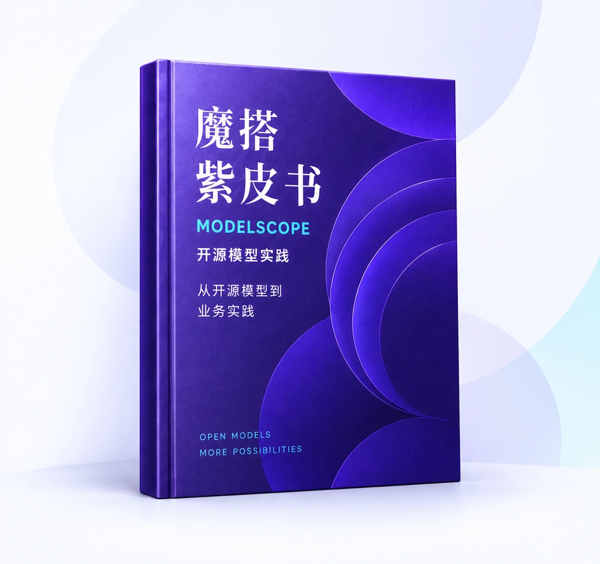

<h1 align="center">ModelScope Cookbook · 魔搭紫皮书</h1>

<p align="center"><strong>让开源模型，从知识走向实践。</strong></p>
<p align="center">选得对 · 跑得起 · 调得好 · 用得上</p>

<p align="center">
  
</p>

<p align="center">
  <a href="README.md">English</a> · 简体中文
</p>

<p align="center">
  <a href="LICENSE"></a>
  <a href="#内容目录"></a>
  <a href="https://github.com/modelscope/ms-cookbook/pulls"></a>
</p>

<p align="center">
  <a href="#快速开始">快速开始</a> ·
  <a href="https://modelscope.cn/studios/canghe/ms-cookbook">在线阅读</a> ·
  <a href="#内容目录">探索全书</a> ·
  <a href="#参与贡献">参与贡献</a> ·
  <a href="https://my.feishu.cn/wiki/TjiUw6B2ZiEKDbk3ZTJcAQ3MnS1">阅读飞书原稿</a>
</p>

## 这是什么项目？

**魔搭紫皮书是一个面向开发者的开源模型应用实战项目，帮助读者把开源 AI 模型用到具体任务中。** 项目通过操作教程与场景案例，将模型选型、推理运行、数据准备、微调评测与应用开发串成一条完整的学习路径。

面对一个业务需求，该选什么模型？手里的硬件能不能跑？如何让模型适应自己的数据，又怎样判断效果有没有提升？本书围绕这些实际问题，结合魔搭生态中的 **EvalScope、ms-swift、DiffSynth**，以及本地推理工具与智能体框架，逐步讲解实现方法与选择依据。

项目希望帮助读者建立**选模型、跑模型、验证效果、构建应用**的实践能力。你可以从第一个推理示例开始，也可以直接探索企业知识问答、语音助手、客服质检、图像生成及工具调用等应用场景。

## 你能从中获得什么？

- **🧭 选得对：把需求转化为模型任务。** 明确输入、输出与评估标准，结合具体问题比较模型，建立有依据的选型方法。
- **🛠️ 跑得起：用现有资源开始实践。** 从模型下载、环境准备，到本地与云端推理、模型量化，理解运行条件与资源需求。
- **📊 调得好：让优化有数据、有验证。** 学习训练数据准备、轻量微调与偏好对齐，通过基线对比和评测检验效果。
- **🚀 用得上：将模型能力接入应用。** 跟随 RAG、语音和生成式 AI 案例开展实践，再通过 MCP 与 Skill 探索工具连接和可复用工作流。

### 找到你的阅读起点

| 你的目标 | 推荐阅读路径 |
| --- | --- |
| 跑通第一个开源模型 | **从零开始：** 基础认知 → 任务选型 → 第一次推理 |
| 让模型适应自己的场景 | **深入模型：** 训练数据 → 微调 → 评测 |
| 开发一个 AI 应用 | **走向应用：** 知识问答 → AIGC → Agent 与工具 |

书籍正文与网站界面目前采用**简体中文**。本仓库提供阅读网站、章节正文与配套媒体资源，英文 README 提供项目概览与运行说明。

## 快速开始

### 环境要求

- Git，用于克隆仓库；也可从 GitHub 下载 ZIP 压缩包并解压。
- Python 3，用于运行本地 HTTP 服务。
- 现代浏览器。

运行阅读网站无需安装项目依赖、执行构建、配置 API 密钥或使用 GPU。各章实践可能需要额外的软件、模型文件、访问凭据或硬件，具体要求以章节说明为准。

### 本地运行

```bash
git clone https://github.com/modelscope/ms-cookbook.git
cd ms-cookbook
python3 -m http.server 4173 --bind 127.0.0.1
```

打开 [http://127.0.0.1:4173/#home](http://127.0.0.1:4173/#home) 即可阅读。在终端按 `Ctrl+C` 停止服务。

如果 `4173` 端口已被占用，请将命令与浏览器地址中的端口一并改为 `4174`。保持 `index.html` 与 `assets/` 目录的相对位置，并以仓库根目录作为 HTTP 服务目录。

下载完成后，仓库内的阅读内容可在本地访问。飞书原稿及其他外部资源链接需要联网，部分资源可能需要访问权限。

## 内容目录

| 篇目 | 主题 | 章节 |
| --- | --- | --- |
| 第一篇 | 认识开源模型 | 1–4 |
| 第二篇 | 从问题出发：找到适合场景的开源模型 | 5–6 |
| 第三篇 | 跑得起：让第一个开源模型工作起来 | 7–11 |
| 第四篇 | 调得好：把通用模型变成场景模型 | 12–15 |
| 第五篇 | 场景篇：从模型走向完整业务系统 | 16–19 |
| 第六篇 | AIGC 特别篇 | 20–24 |
| 第七篇 | Agent 特别篇 | 25–30 |
| 第八篇 | 基础知识补充 | 31 |

可通过网站的全书目录系统阅读，沿阅读路径逐步学习，也可从场景实践入口直接进入感兴趣的任务。

### 内容状态

当前内容快照日期为 **2026 年 9 月 14 日**，共 **31 章，其中 30 章可读**。第 23 章《开源模型也能做出像样的AI短剧吗？》保留占位说明，正文待补充。

快照包含 347 处正文图片引用与 12 个附件链接。内容随仓库保存，后续修改不会自动从[飞书原稿](https://my.feishu.cn/wiki/TjiUw6B2ZiEKDbk3ZTJcAQ3MnS1)同步。

### 阅读体验

网站提供全文关键词搜索、阅读路径、章节导航、代码复制、图片放大与 KaTeX 公式渲染，适配桌面和移动端。章节图片、附件与渲染资源随仓库提供，便于下载后在本地阅读。

## 自动发布

网站部署于[公开的魔搭创空间](https://modelscope.cn/studios/canghe/ms-cookbook)。`main` 分支中的站点文件更新后，GitHub Actions 的 **Deploy to ModelScope Studio** 工作流会自动运行；维护者也可在 Actions 页面手动触发。

工作流将已提交的站点文件同步至创空间的 `master` 分支，生成中文创空间卡片并触发部署，核对线上页面与源码提交后才会完成。发布凭据保存在仓库的 `MODELSCOPE_API_KEY` Secret 中。代码与内容统一在 GitHub 维护。

## 仓库结构

```text
.
├── index.html                  # 网站入口与页面结构
├── favicon.svg                 # 网站图标
├── assets/
│   ├── content.js              # 书籍元数据与章节正文
│   ├── paper.js                # 导航、搜索与阅读交互
│   ├── styles.css              # 基础样式
│   ├── paper.css               # 网站主题与布局
│   ├── paper/                  # 插画、图标与素材来源说明
│   ├── home/                   # 共用视觉资源与字体许可
│   ├── manuscript-20260914/     # 正文图片与附件
│   └── katex/                  # 本地数学公式渲染器与字体
├── README.md                   # 英文说明
├── README.zh-CN.md             # 简体中文说明
├── 使用说明.txt                 # 本地版本说明
└── LICENSE                     # Apache License 2.0
```

网站使用 HTML、CSS 与浏览器端 JavaScript。`index.html` 通过 `assets/content.js` 加载章节数据，通过 `assets/paper.js` 提供阅读交互。页面使用 URL 片段导航，例如 `#home`、`#contents` 与 `#chapter-1`。

## 参与贡献

欢迎通过 [GitHub Issues](https://github.com/modelscope/ms-cookbook/issues) 和 [Pull Requests](https://github.com/modelscope/ms-cookbook/pulls) 参与建设。贡献方向包括技术勘误、说明完善、可复现示例、无障碍访问改进及阅读体验修复。

1. 对于较大改动，请先创建 Issue，说明问题与计划调整的范围。
2. Fork 本仓库，为改动创建独立分支。
3. 说明涉及的章节或页面，并按需提供参考资料与复现步骤。
4. 在本地预览，检查改动涉及的导航、搜索、图片、附件、代码块与公式；涉及布局时，同时检查移动端效果。
5. 提交 Pull Request，说明改动内容与验证方式。更新项目说明时，请保持中英文 README 信息一致。

请保留所贡献材料的来源说明，并确认拥有相应的分享权限。示例与附件中请勿包含访问凭据或个人隐私数据。

## 许可证与致谢

本仓库采用 [Apache License 2.0](LICENSE)。随仓库提供的第三方组件保留各自的许可证：

- [KaTeX](assets/katex/LICENSE)：MIT License。
- [Remix Icon](assets/home/REMIX-LICENSE)：Apache License 2.0。
- [Noto Serif SC](assets/home/NOTO-LICENSE.txt)：SIL Open Font License 1.1。

正文图片与附件的权利归原作者或相应权利人所有。素材来源详见[网站素材说明](assets/paper/ATTRIBUTION.txt)与[共用素材说明](assets/home/ATTRIBUTION.txt)。书中涉及的模型、数据集与工具，适用各自的许可证及使用条款。
